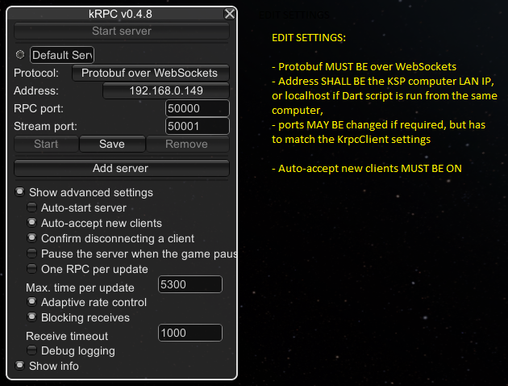
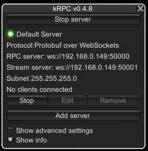

kRPC Dart Library
=================

The kRPC–Dart library intends to provide a way to interact with 
[Kerbal Space Program](https://www.kerbalspaceprogram.com/) game (further referred as KSP), using
[Dart](https://dart.dev/) or [Flutter](https://flutter.dev/) directly. The 
[kRPC](https://krpc.github.io/krpc/index.html) module provides a communication channel through an internal RPC server,
using the Protocol Buffers language of Google (the [protobuf](https://developers.google.com/protocol-buffers)).
The big advantage of this solution is that the kRPC module of KSP can be used to expose a dynamic library of KSP stuff,
and is very resilient to KSP’s new versions.

## Features
### KrpcClient
This class is responsible to connect to kRPC server in KSP. It shall be instantiated with the proper parameters. See
example.

### ProtobufHandler
This class is responsible to manage the inherent dependency to the kRPC protobuf auto-generated classes. See example.

## Development
The aim of this project is to develop a Dart library, Flutter compatible, which will provide the following features:
-	A connector that will use either TCP/IP or WebSockets protocol,
-	A builder that will create the kRPC corresponding API converted into Dart language,
-	A library that can be updated on demand by the builder.

## kRPC dependency
This lib is working on [kRPC](https://krpc.github.io/krpc/) v0.4.8, as the library is built using this version of the 
protobuf format, but it may work with other versions as well.

## The kRPC client
The library exposes the KrpcClient class to connect to kRPC.
kRPC server settings:

After saving the settings and starting the server, you should see:

